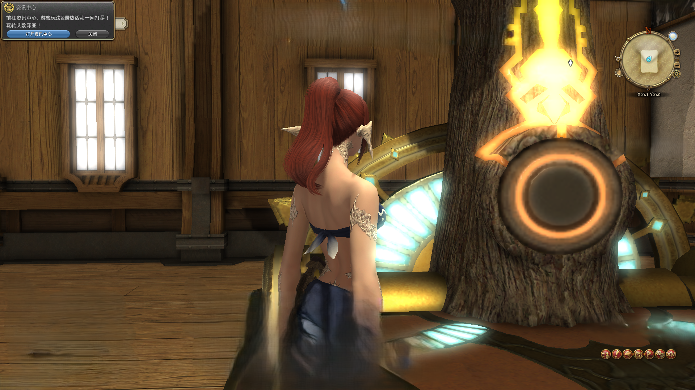

## README

ff14（最终幻想14）使用砍树（孤树无缘）刷金碟币（金蝶游乐场）脚本

### 重要说明

1. 本脚本仅供交流学习，请勿利用该脚本完成违规行为
2. 实测在buff加成下每小时大概2.5w金碟币，在金蝶大庆典活动加持下，能在3.2w游戏币每小时以上
3. 在测试使用该脚本时候，请保持人在旁边的状态，或者购买该**孤树无缘**家具在家中进行测试学习，否则会被别人举报
4. 本脚本只在作者自己电脑上测试，会尽量给出相关运行条件，如果在你的电脑上测试不通过，请检查相关条件或者修改部分代码参数（代码注释以及日志部分非常明确）
5. 因为只在自己电脑上测试了，就不构建对象文件了，所以需要使用者搭一下环境（你都用github检索了还怕搭个简单的环境么）

### 环境相关

1. 下载[python](https://www.python.org/) 配置环境变量
2. 下载[poetry](https://python-poetry.org/docs/) 和 [uv](https://docs.astral.sh/uv/#highlights) 框架，配置环境变量
3. 下载 https://github.com/UB-Mannheim/tesseract/wiki 并将安装文件夹和其子文件夹 `tessdata` 设置为环境变量
4. 操作系统不要缩放
5. 游戏内，窗口模式，1920x1080 100%尺寸  标准品质（笔记本电脑） 标准分辨率（先改好操作系统缩放100%，再启动游戏改分辨率）（这里主要是为了减少GPU压力）
6. 最常见的可能错误就是窗口分辨率不对，代码的日志会打印当前帧窗口的分辨率，请确认是1920x1080
7. 将资讯中心置于左上角（用于定位是否在砍树游戏中）
8. 保证橙色光圈在右边中部，尽可能大一些
9. 砍树相关UI需要右击还原，具体为：
	1. 右击树所出现的确认参加UI
	2. 难度选择UI
	3. 实际砍树UI
	4. 是否双倍积分UI
	5. 是否取消此次砍树UI
10. 完成后基本UI布局和站位如下：

### 启动

管理员命令运行命令行或者`powershell`，执行`uv sync`或者`poetry install`，然后启动命令`poetry run app`即可启动，
下拉框内选择ff14的窗口，然后切换到ff14窗口，使用快捷键`ctrl+F1`即可开始

#### 其他事项

1. 非常偶尔会出现卡帧的现象，等待10s会自动修复，在高性能设备高帧率的显示屏下出现概率会更低